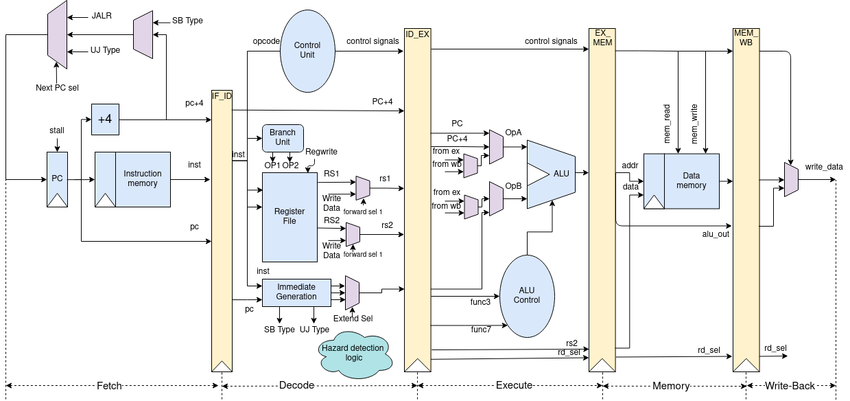

# Pipelined Datapath for RV32I

In a typical RISC-V (RV32I) 5-stage pipeline, the goal is to maximize throughput by overlapping the execution of multiple instructions. The diagram below illustrates a common microarchitecture implementation, highlighting the individual pipeline stages, the key functional blocks, and the logic required to handle hazards and control signals.

## Overview

1. **Stages**  
   - **IF (Instruction Fetch)**  
   - **ID (Instruction Decode / Register Fetch)**  
   - **EX (Execute / ALU)**  
   - **MEM (Memory Access)**  
   - **WB (Write Back)**  

2. **Pipeline Registers**  
   - Each vertical yellow bar in the figure represents a pipeline register (e.g., IF/ID, ID/EX, EX/MEM, MEM/WB). These registers store instruction-related information as it flows through the pipeline.

3. **Hazard Detection and Forwarding**  
   - A dedicated “Hazard detection logic” block in the ID stage checks for potential data dependencies.  
   - **Forwarding (bypassing)** hardware in the EX stage (the MUXes feeding ALU inputs) can supply results from later pipeline stages (EX/MEM or MEM/WB) to earlier stages if needed.

4. **Control Signals**  
   - The “Control Unit” in the ID stage decodes the instruction opcode and generates signals that steer the datapath (ALU operation, memory access, register writes, etc.).  
   - These signals are pipelined forward through each stage so that each instruction “carries” its control settings.

---

## Deep Dive into Each Stage

The RV32I standard pushes each instruction into these stages:

### 1. Instruction Fetch (IF)
- **Key Components**:
  - **Program Counter (PC)**: Holds the address of the current instruction.
  - **Instruction Memory**: The memory from which instructions are fetched.
  - **PC Adder**: Typically `PC + 4` to get the next sequential instruction address.
  - **Branch/Jump Logic**: If a branch is taken, the PC is updated with the target address instead of `PC + 4`.

- **What Happens**:
  1. The PC is used as the address to fetch the instruction from instruction memory.
  2. The instruction is latched into the IF/ID pipeline register.
  3. Simultaneously, the PC is updated for the next cycle (either `PC + 4` or a branch target).

- **Pipeline Register (IF/ID)**:
  - Stores the fetched instruction.
  - Captures the incremented PC (sometimes called `PC + 4`) for use in the next stage (e.g., calculating branch offsets).

### 2. Instruction Decode / Register Fetch (ID)
- **Key Components**:
  - **Control Unit**: Decodes the opcode and generates signals to control the rest of the pipeline (e.g., ALU operation, register write enable, memory read/write).
  - **Register File**: Reads source registers `RS1` and `RS2`.
  - **Immediate Generation**: Extracts and sign-extends immediate fields (e.g., for loads, stores, branches).

- **What Happens**:
  1. The instruction is decoded to identify the type (R-type, I-type, S-type, B-type, U-type, or J-type).
  2. The register file outputs the data from the source registers (`rs1_data` and `rs2_data`).
  3. The immediate generator creates the 12-bit or 20-bit immediate, sign-extended to 32 bits if needed.
  4. The hazard detection logic checks if the previous instruction’s result is needed here (and if it’s not yet available). It can stall the pipeline if necessary.

- **Pipeline Register (ID/EX)**:
  - Stores the read register values, immediate, control signals, and relevant instruction fields (destination register number, function codes, etc.).

### 3. Execute (EX)
- **Key Components**:
  - **ALU (Arithmetic Logic Unit)**: Performs operations (add, subtract, shift, AND, OR, etc.).
  - **ALU Control**: Determines which operation the ALU should perform based on the instruction’s funct3/funct7 fields and the main control signals.
  - **Branch Logic**: Compares the ALU result (or register values) to decide if a branch should be taken.  
  - **Forwarding MUXes**: Allows values from the MEM or WB stage to be forwarded to the ALU inputs if the current instruction depends on a not-yet-written-back result.

- **What Happens**:
  1. The source operands (either directly from the register file or forwarded from later stages) are fed into the ALU.
  2. The ALU computes the required operation (e.g., addition for `add`, address calculation for load/store, or branch comparison).
  3. For branch instructions, the EX stage determines whether the branch is taken. If it is, the pipeline control logic updates the PC with the branch target and may flush instructions fetched after the branch.
  4. The memory address (for loads/stores) or the final ALU result (for R-type instructions) is latched into the EX/MEM register.

- **Pipeline Register (EX/MEM)**:
  - Stores the ALU result, branch decision, data to be stored (for store instructions), and updated control signals.

### 4. Memory Access (MEM)
- **Key Components**:
  - **Data Memory**: Holds the data for load/store instructions.
  - **Memory Control Signals**: Indicate read/write operations, byte/half-word/word access, etc.

- **What Happens**:
  1. If the instruction is a load, the data memory is accessed at the address computed in EX, and the data is read out.
  2. If the instruction is a store, the data from the register file (forwarded from ID or EX, if needed) is written to memory at the computed address.
  3. The memory read data (for loads) or the ALU result (for non-load instructions) is latched into the MEM/WB register.

- **Pipeline Register (MEM/WB)**:
  - Stores either the loaded data (for a load instruction) or the ALU result (for an arithmetic instruction).

### 5. Write Back (WB)
- **Key Components**:
  - **Register File Write Port**: Writes the result to the destination register specified by the instruction.

- **What Happens**:
  1. For load instructions, the data read from memory is written into the destination register.
  2. For R-type instructions (arithmetic/logic), the ALU result is written back.
  3. Any instruction that produces a result (e.g., `addi`, `jal`, etc.) writes to the register file in this stage.

- **Completion**:
  - Once the result is written back, the instruction is considered complete.
  - Meanwhile, other instructions are simultaneously in earlier stages of the pipeline.

---

## Hazard Detection and Control

1. **Data Hazards**  
   - Occur when an instruction needs a value that has not yet been written back by a previous instruction.  
   - **Forwarding**: The pipeline includes forwarding paths (and MUXes) that can feed the ALU the result directly from the EX or MEM stages.  
   - **Stalls**: If forwarding is insufficient (e.g., a load-use hazard), the hazard detection logic can stall the pipeline.

2. **Control Hazards**  
   - Arise from branch instructions and jumps.  
   - **Branch Prediction**: Some designs predict not taken or use more advanced predictors to reduce stalls.  
   - **Flush**: If the branch is mispredicted, instructions in the pipeline that are on the wrong path must be invalidated (flushed).

3. **Hazard Detection Logic**  
   - Typically located in the ID stage to monitor instruction dependencies.  
   - It can insert “no-op” instructions (bubbles) or stall the pipeline if necessary.  
   - It also sends signals to flush the pipeline on a mispredicted branch.

---

## Pipeline Performance Metrics

1. **Cycles Per Instruction (CPI)**

   One common way to measure pipeline performance is by tracking how many cycles each instruction requires on average:

   $$
   \text{CPI} = \frac{\text{Total Clock Cycles}}{\text{Total Instructions}}
   $$

   - In an ideal pipeline (no hazards or stalls, perfect branch prediction, etc.), the CPI can approach 1.  
   - Real implementations incur additional cycles due to hazards, stalls, mispredictions, and memory/cache delays, causing the effective CPI to exceed 1.

2. **Instructions Per Cycle (IPC)**

   Instructions per cycle (IPC) is the reciprocal of CPI:

   $$
   \text{IPC} = \frac{1}{\text{CPI}}
   $$

   - If your pipeline achieves a CPI of 1, you have an IPC of 1, meaning one instruction completes each cycle (after the pipeline is filled).
   - Superscalar processors can have an IPC > 1 by issuing multiple instructions per cycle.

3. **Latency vs. Throughput**  
   - **Latency**: Time for one instruction to pass through all 5 stages (5 cycles in an ideal design).  
   - **Throughput**: Once the pipeline is full, ideally one instruction finishes per cycle.

4. **Branch Penalty**  
   - The extra cycles spent if a branch is mispredicted. Minimizing this penalty via early branch resolution or sophisticated prediction hardware is key to maintaining high throughput.

5. **Stalls**  
   - The pipeline may stall when data is not yet available (load-use hazard) or when the next instruction’s operands depend on an instruction still in the pipeline.

---

## Comparison with an Unpipelined Datapath

In an **unpipelined** (single-cycle or multi-cycle) design, each instruction must complete all phases (fetch, decode, execute, memory access, and write-back) before the next instruction begins. This leads to:

- **Longer CPI**: Even though a single instruction may have a shorter or equal latency in some multi-cycle designs, you can only process one instruction at a time. The effective CPI can be significantly higher (e.g., 5 cycles per instruction for a 5-stage multi-cycle CPU).
- **Lower Throughput**: No instruction overlap means you finish one instruction fully before starting the next.

By contrast, in a **pipelined** design:

- **Higher Throughput**: Once the pipeline is filled, an instruction completes every cycle (ideal CPI ≈ 1).  
- **Instruction Overlap**: Each pipeline stage handles a different instruction concurrently, effectively “pipelining” the workload.  
- **Trade-Offs**: Increased control complexity (hazard detection, forwarding, branch prediction) and the potential for pipeline stalls. However, these complexities are usually offset by the performance gains of overlapping instruction execution.

Overall, the pipelined datapath significantly improves throughput over an unpipelined design by leveraging parallelism within the instruction execution flow, despite requiring more intricate control logic and hardware to handle hazards.
