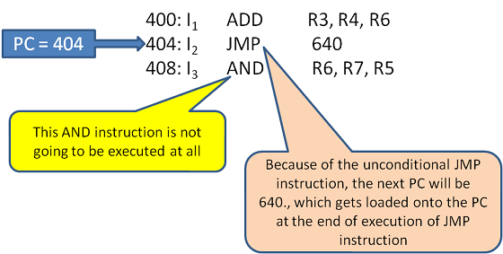

# Control Hazards

Control hazards arise when the flow of instruction execution changes due to branch or jump instructions. In a pipelined processor, the next instruction is fetched before it’s known whether a branch will be taken. If the branch is taken, the instructions fetched in the meantime are invalid and must be flushed, causing performance penalties.

In this example, the jump instruction at PC = 404 changes the next PC to 640, so the AND instruction at PC = 408 is never executed. The pipeline, however, may have already fetched it by the time it realizes the jump is taken, creating a control hazard.

---

## 1. Overview of Control Hazards

1. **Branches (Conditional/Unconditional)**  
   - **Conditional Branch**: The pipeline needs to evaluate a condition (e.g., `BEQ`, `BNE`) to decide the next PC.  
   - **Unconditional Jump**: The next PC is known in advance (e.g., `JAL` in RISC-V), but still requires the pipeline to redirect the fetch address.

2. **Pipeline Impact**  
   - While the CPU is determining whether the branch is taken, the pipeline might continue fetching instructions sequentially.  
   - If the branch is indeed taken, the fetched instructions are on the wrong path and must be discarded (flushed).

3. **Branch Delay**  
   - The number of cycles between the time a branch is decoded and the time the pipeline knows the correct next PC.  
   - Each mispredicted branch introduces a “branch penalty” equal to the number of pipeline stages that must be flushed.

---

## 2. Basic Strategies to Handle Control Hazards

### 2.1 Stall Until Branch is Resolved
- **Definition**: The pipeline halts instruction fetch until the branch outcome is known.
- **Drawback**: Directly stalls the pipeline for several cycles on every branch. This is straightforward but leads to significant performance loss if branches are frequent.

### 2.2 Predict Not Taken
- **Definition**: Always assume a branch is *not* taken, fetch instructions sequentially, and only flush if the branch is actually taken.
- **Pros**: Simple to implement.  
- **Cons**: If the branch is taken frequently (e.g., loops), many mispredictions and flushes will occur.

### 2.3 Predict Taken
- **Definition**: Always assume a branch is *taken*, and immediately fetch from the target address. Flush if it’s actually not taken.
- **Pros**: Potentially good if most branches are taken (e.g., backward branches in loops).  
- **Cons**: Poor performance if many branches are not taken.

---

## 3. More Advanced Branch Prediction Techniques

### 3.1 Dynamic Branch Prediction
- **Definition**: Uses hardware that adapts to the program’s branching behavior at runtime.
- **2-State Machine (1-bit Predictor)**  
  - Each branch has a single bit of history: “taken” or “not taken.”  
  - If the branch is taken once, predict taken next time; if it’s not taken, predict not taken next time.
  - **Limitation**: A single misprediction flips the predictor’s state immediately.

- **2-bit Saturating Counter**  
  - Each branch has a small finite state machine with four states: strongly taken, weakly taken, weakly not taken, strongly not taken.  
  - Requires two mispredictions in a row to flip from strongly-taken to strongly-not-taken (or vice versa), reducing misprediction for loops and repetitive branches.

### 3.2 Two-Level Predictors
- **Local History**: Maintains per-branch history registers, capturing patterns in each branch’s behavior.  
- **Global History**: Tracks taken/not-taken outcomes across multiple branches in a single global register.  
- **Combination Predictors**: Merge local and global histories to refine predictions further, using multiple tables and dynamic selection of the best predictor.

---

## 4. Branch Target Buffer (BTB)

- **Definition**: A cache-like structure that stores the target addresses of previously encountered branches or jumps.  
- **Usage**:  
  1. On fetching an instruction, the PC indexes into the BTB.  
  2. If there’s a match (hit), the BTB provides a predicted target address.  
  3. If the instruction is predicted to be a branch, the pipeline can fetch from the predicted target in the next cycle, reducing the penalty.
- **Complement to Branch Prediction**:  
  - While the branch predictor guesses taken/not taken, the BTB provides the *where* (the target address).  
  - Unconditional jumps (e.g., `JAL`) benefit from storing their target in the BTB.

---

## 5. Minimizing the Control Hazard Penalty

1. **Early Branch Resolution**  
   - Resolve the branch in the ID or EX stage instead of later stages.  
   - Fewer instructions get fetched on the wrong path, reducing the flush penalty.

2. **Branch Delay Slots (Legacy Approach)**  
   - Some architectures (e.g., older MIPS) define that the instruction immediately after a branch is always executed, regardless of whether the branch is taken.  
   - Modern designs typically rely on prediction and pipelines rather than delay slots.

3. **Speculative Execution**  
   - Process both potential branch paths in parallel (common in high-end CPUs).  
   - Discard the incorrect path once the branch condition is resolved.  
   - Significantly increases hardware complexity and power usage.

---

## 6. Summary

Control hazards can degrade pipeline performance significantly because they force the CPU to throw away work if the pipeline has fetched the wrong instructions. **Branch prediction**, **branch target buffers**, and **early branch resolution** are crucial techniques for mitigating these hazards. By reducing the frequency and penalty of mispredictions, a pipelined processor can maintain high throughput even in the presence of frequent branching.

For more details on branch predictors, go to [Section 2.6](../branch_prediction.md) of this book, which dive deeper into branch prediction algorithms and design within hardware.
