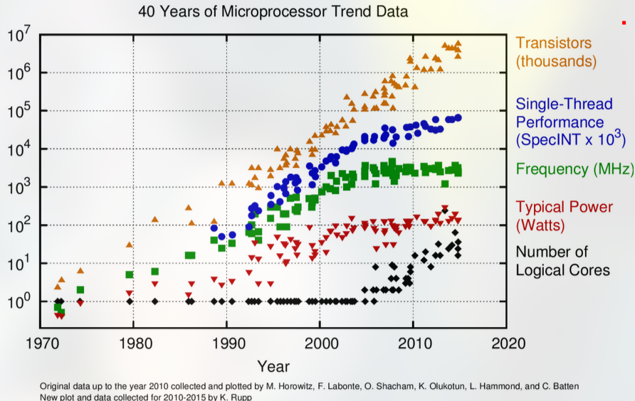

# Moore’s Law and Trend Scaling

## 1. Introduction to Moore’s Law
- **Definition and Origin**  
  - Gordon Moore’s 1965 prediction: transistor density on integrated circuits doubles every ~18–24 months.  
  - **Equation:**  
    $$ N(t) = N_0 \cdot 2^{t/T} $$
    where $ N(t) $ is the number of transistors at time $ t $, $ N_0 $ is the initial transistor count, and $ T $ is the doubling period.
  - Implication: design teams must anticipate future resources (transistors, performance) when starting a project.
- **Historical Context**  
  - Early exponential growth in transistor count fueled dramatic improvements in CPU frequency, performance, and integration of features.

## 2. Historical Trends in Processor Performance
- **Frequency Scaling (1970s – mid-2000s)**  
  - Performance gains primarily from faster clock speeds.  
  - **Dynamic Power Consumption Equation:**  
    $$ P_{dyn} = C V^2 f $$
    where $ C $ is the capacitance, $ V $ is the voltage, and $ f $ is the clock frequency.
  - Example: Pentium 4 with 31 pipeline stages, pushing frequency up to ~3–4 GHz.  
  - Graphical evidence: CPU clock rates increased steadily until power constraints became dominant.
- **Limitations & Changing Landscape**  
  - As frequency rises, power and heat dissipation become critical issues.  
  - The “Power Wall”: rising clock speeds lead to exponential increases in power consumption.

## 3. Transistor Scaling and Dennard’s Law
- **Dennard Scaling Basics**  
  - Under ideal conditions, as transistors shrink, power density remains roughly constant.  
  - **Dennard Scaling Equation:**  
    $$ P_{dyn} = \alpha C V^2 f $$
    where $ \alpha $ represents the activity factor (a constant under ideal scaling).  
  - In theory: Smaller transistors allow for lower voltage and higher frequency at the same power level.
- **End of Dennard Scaling**  
  - Post mid-2000s, leakage currents and other physical effects break the ideal scaling model.  
  - Frequency gains slow dramatically; we can’t keep lowering voltage as easily.  
  - Power density stops being constant, leading to thermal issues.

## 4. Consequences of the End of Frequency Scaling
- **Shift to Multicore and Parallelism**  
  - With clock speeds plateauing, performance gains must come from adding more cores and exploiting parallel execution.  
  - **Amdahl’s Law (for parallel speedup):**  
    $$ S = \frac{1}{(1-p) + \frac{p}{N}} $$
    where $ p $ is the fraction of the task that can be parallelized and $ N $ is the number of cores.
  - GPUs, many-core processors, and specialized accelerators become more common.
- **Better Microarchitecture**  
  - Innovations include deeper pipelines, out-of-order execution, speculation, and improved caching.  
  - Focus shifts toward extracting instruction-level parallelism (ILP) as well as thread-level and data-level parallelism.
- **Specialized Hardware**  
  - Domain-specific accelerators (e.g., GPUs for graphics/AI, custom ASICs) are developed for efficient performance on specialized tasks.

## 5. Design for Moore’s Law in Modern Context 

Consider this graph, which plots five major trends over approximately 40 years of microprocessor development: transistor count, single-thread performance, frequency, typical power, and the number of logical cores.

- **Transistor Count (Orange Triangles)**  
   - **Exponential Growth:** The transistor count curve follows a near-exponential climb (in line with Moore’s Law) from the early 1970s to around 2020.  
   - **Many Orders of Magnitude:** You can see that transistor counts went from thousands in the 1970s to billions by the 2010s—a million-fold increase.  
   - **Enabler for Integration:** More transistors enabled not only higher performance but also the integration of more on-chip features (e.g., caches, multiple cores, specialized accelerators).

- **Single-Thread Performance (Blue Diamonds)**  
   - **Correlates with Frequency (Early Years):** In the 1970s–1990s, single-thread performance rose in tandem with increases in clock frequency and transistor count.  
   - **Slowing Growth Post-2000s:** As frequency scaling hit power and thermal limits, single-thread performance growth also began to slow. This plateau is evident after the mid-2000s.

- **Frequency (Green Squares)**  
   - **Steady Climb, Then Plateau:** You can see a clear upward trend in clock frequency from a few MHz in the 1970s to several GHz by the early 2000s. Around the mid-2000s, frequency stops rising rapidly—this marks the onset of the so-called “power wall.”  
   - **Thermal Constraints:** Past ~3–4 GHz, it became difficult to push frequency higher without encountering disproportionate increases in power consumption and heat generation.

- **Typical Power (Red Squares)**  
   - **Growth with Frequency:** As clock speeds rose and more transistors were integrated, typical power consumption climbed significantly (often from under 1 W in the earliest microprocessors to tens or even 100 W+ in modern high-performance CPUs).  
   - **The Power Wall:** This curve highlights how higher frequency and more transistors led to exponential increases in power usage, eventually forcing the industry to shift focus from purely increasing clock speed to more power-efficient design strategies.

- **Number of Logical Cores (Black Circles)**  
   - **Single-Core Dominance (Until Mid-2000s):** For much of the time period shown, processors had just one logical core (or a small handful, in the case of some high-end or experimental designs).  
   - **Multi-Core Era:** Around the mid-2000s, you see a noticeable jump in the number of cores. As frequency scaling stalled, manufacturers turned to multi-core designs to keep overall performance improving. Modern CPUs often have many cores, reflecting a shift toward parallel and multi-threaded workloads.

### Connecting the Trends
- **Moore’s Law vs. Dennard Scaling**  
  - Moore’s Law (transistor doubling) continues, which explains the ongoing rise in transistor counts.  
  - Dennard Scaling (the ability to increase frequency without increasing power density) broke down in the mid-2000s, which explains why frequency (green) and single-thread performance (blue) plateau while power (red) continues to rise.
  
- **From Frequency to Parallelism**  
  - With the end of frequency scaling, the industry adopted multi-core architectures (black) to utilize the additional transistors more effectively. This shift is clearly visible in the increasing number of logical cores.

- **Thermal and Power Constraints**  
  - As shown by the power curve, it became unsustainable to keep pushing clock speeds higher. Hence, designers turned to power-efficient methods—lower voltage operation, dynamic frequency scaling, and specialized hardware—to continue delivering performance gains.

Overall, the graph vividly illustrates the transition from the single-thread frequency race of the 1990s–early 2000s to the multi-core, power-constrained era we live in now. It underscores why modern CPU and SoC designs focus on parallelism, specialization (e.g., GPUs, AI accelerators), and advanced process technologies (FinFETs, 3D stacking) rather than simply cranking up the clock rate.

## 6. Summary and Looking Forward
- **Balancing Constraints**  
  - Future designs must balance functional requirements, performance, power, and cost.  
  - Parallelism and specialization are key strategies for continued performance scaling.
- **Key Takeaways**  
  - **Moore’s Law** remains relevant but is now as much about multicore and heterogeneous computing as it is about clock speed.  
  - **Dennard Scaling** has effectively ended, leading to the “power wall” and driving the need for new architectural innovations.  
  - Future architectures will likely combine improved microarchitecture, increased concurrency, and specialized designs to meet ever-growing computational demands.

---

**References & Further Reading**  
- Slides on **Historical Trends**, **Transistor Scaling**, and **Dennard Scaling** (ECE411).  
- Hennessy & Patterson, *Computer Architecture: A Quantitative Approach*.  
- Robert P. Colwell, *The Pentium Chronicles* (on design goals and practical CPU development).
