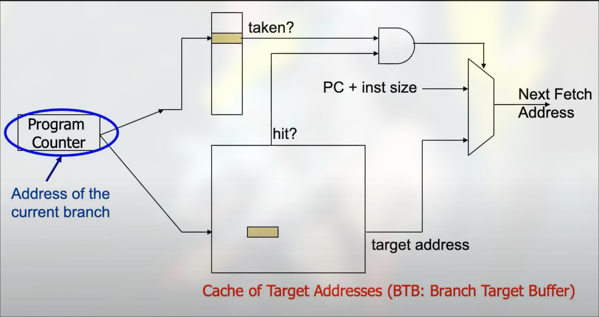
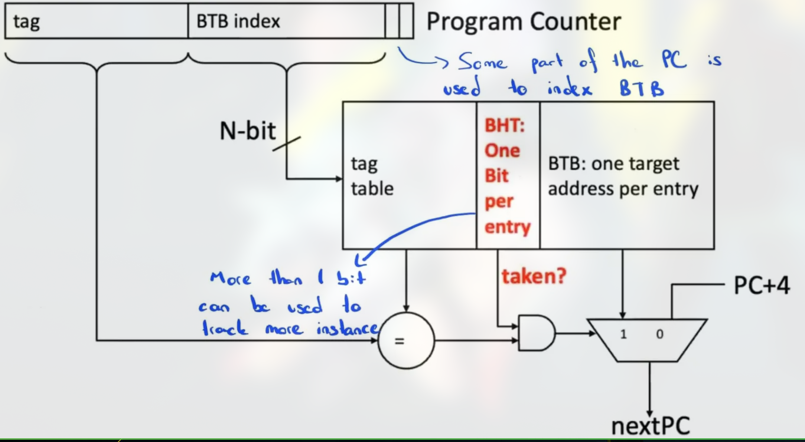
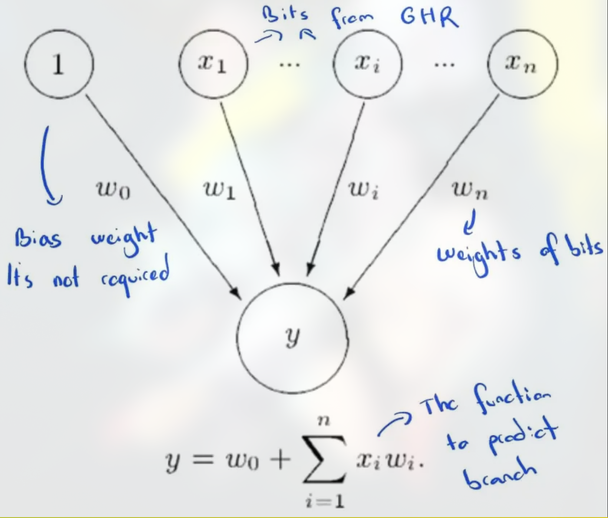

# Branch Prediction - A Deep Dive

Branch prediction is crucial for improving performance in pipelined processors, especially those with multiple pipeline stages. By predicting whether a branch (conditional or unconditional) will be taken or not, the CPU can continue fetching and executing instructions without waiting for the branch’s actual outcome. This technique helps minimize pipeline stalls and flushes, thereby increasing throughput.

---

## 1. Overview

Modern processors rely on sophisticated branch prediction algorithms to reduce the branch penalty. Broadly, **branch prediction** strategies can be categorized as **static** or **dynamic**:

- **Static Branch Prediction**: Makes a branch decision without runtime feedback (e.g., “Always Taken,” “Always Not Taken”).
- **Dynamic Branch Prediction**: Adapts predictions based on the actual runtime behavior of branches (e.g., 1-bit, 2-bit saturating counters, two-level predictors, etc.).

Below is an example of the basic hardware for a **dynamic** branch predictor. The program counter (PC) indexes into a prediction table that stores the historical outcome of previously encountered branches, and a separate **Branch Target Buffer (BTB)** caches the target addresses of these branches.

---

## 2. Static Branch Prediction

### 2.1 Always Not Taken
- **Definition**: The CPU always predicts that the branch will not be taken, continuing sequentially.
- **Accuracy**: Around 30–40% for typical workloads, since many branches (especially loops) are often taken.
- **Pros**: Very simple hardware (no additional tables or counters).
- **Cons**: High misprediction rate for backward branches (loops) or frequently taken branches.

### 2.2 Always Taken
- **Definition**: The CPU always predicts that the branch will be taken, fetching instructions from the branch target immediately.
- **Accuracy**: Generally better than “Always Not Taken” because many real-world branches (like loops) are taken frequently.
- **Pros**: Simple to implement; better performance than “Always Not Taken” in loop-heavy code.
- **Cons**: Forward branches that are not taken will cause mispredictions.

### 2.3 Backward Taken, Forward Not Taken
- **Definition**: Predicts that backward branches (e.g., those used for loops) are taken and forward branches are not taken.
- **Pros**: Offers a decent compromise for many typical code structures with loops.
- **Cons**: Still static—cannot adapt to runtime changes in branch behavior.

### 2.4 Profile-Guided Prediction
- **Definition**: Uses compiler-generated profiling data to predict branches. The compiler embeds likely branch outcomes based on observed runs.
- **Pros**: Potentially higher accuracy than simpler static methods if runtime behavior matches profiling runs.
- **Cons**: Cannot adapt to new or changing runtime conditions. Requires an extra profiling step.

---

## 3. Dynamic Branch Prediction

Dynamic branch prediction uses **runtime** feedback to refine predictions. The predictor typically consults a table indexed by some bits of the program counter (PC), and optionally the global or local branch history.

### 3.1 Last Time Predictor (1-bit Predictor)
- **Definition**: Predicts a branch will do the same thing it did last time.  
- **Hardware**: A single bit per branch entry in the table, which flips based on the last outcome (taken/not taken).
- **Pros**: Good for loop-like behavior, as it quickly stabilizes on “taken” for backward branches.
- **Cons**: If the branch outcome alternates frequently, accuracy suffers.

Below is a simplified logic diagram for a **Last Time Predictor**:

### 3.2 Two-Level Prediction

Two-level predictors track a more extensive history of branch outcomes.

#### 3.2.1 Global Branch Correlation
- **Global History Register (GHR)**: A shift register that stores recent branch outcomes (taken/not taken) across **all** branches.
- **Pattern History Table (PHT)**: An array of saturating counters indexed by the GHR. The predictor uses these counters to guess the next branch outcome.
- **Pros**: Captures correlated behavior between multiple branches.  
- **Cons**: Larger hardware overhead as the GHR and PHT sizes grow.

#### 3.2.2 Local Branch Correlation
- **Per-Branch History**: Each branch has its own local history register and local PHT.
- **Pros**: Tracks each branch’s behavior independently. Good for code with strongly repetitive patterns on a per-branch basis.
- **Cons**: May not capture inter-branch correlations.

### 3.3 Hybrid Predictors

- **Definition**: Combines multiple predictors (e.g., a local predictor and a global predictor) and uses a “chooser” to select which prediction is likely to be more accurate for a given branch.
- **Example**: **Alpha 21264** introduced a hybrid scheme with separate local and global predictors plus a selection mechanism.
- **Pros**: Better accuracy; different branches may favor different types of prediction.
- **Cons**: Requires more hardware (multiple tables, selector counters) and can increase prediction latency.

### 3.4 Perceptron Branch Predictor

The **Perceptron** branch predictor uses a simplified machine-learning model (a single-layer perceptron) to predict branch outcomes. Each branch is associated with a set of **weights**, and each bit in the Global History Register (GHR) is multiplied by a corresponding weight. The sum is then compared to a threshold to decide if the branch is taken or not.

- **Pros**: Can learn linearly separable patterns that simpler predictors might miss. Adapts over time with training.
- **Cons**: Requires additional hardware for storing and updating weights. Longer training (warmup) time compared to simpler saturating counters.

---

## 4. TAGE (Tagged Geometric History Length)

- **Definition**: TAGE uses multiple tables, each indexed by a **different** global history length. The idea is to capture short-term, medium-term, and long-term branch correlations in parallel.
- **Pros**: Highly accurate for a wide range of branch behaviors.
- **Cons**: Complex hardware design and indexing scheme. Must choose table sizes and hashing carefully to balance performance and cost.

---

## 5. Putting It All Together

Modern processors often use a **combination** of these methods:
1. **Dynamic branch prediction** with multi-level history and saturating counters.
2. **Branch Target Buffer (BTB)** to quickly fetch the target address of a branch.
3. **Speculative execution** to reduce penalty on mispredicted paths.
4. **Hybrid approaches** (e.g., combining local and global predictors, or including advanced perceptron or TAGE predictors).

By continually refining branch predictions, CPUs maintain a high instruction fetch rate and minimize pipeline stalls caused by mispredictions.

---

## 6. References & Further Reading

- *Digital Design and Computer Architecture (2nd Edition)* by David Harris & Sarah Harris  
- Onur Mutlu Lectures (CMU)  
- **Alpha 21264** documentation for hybrid branch predictor details  

These techniques form the basis of **branch prediction** in modern microarchitectures. While static methods provide a baseline, the real performance gains come from dynamic, adaptive algorithms capable of learning and reacting to runtime branch behavior.
