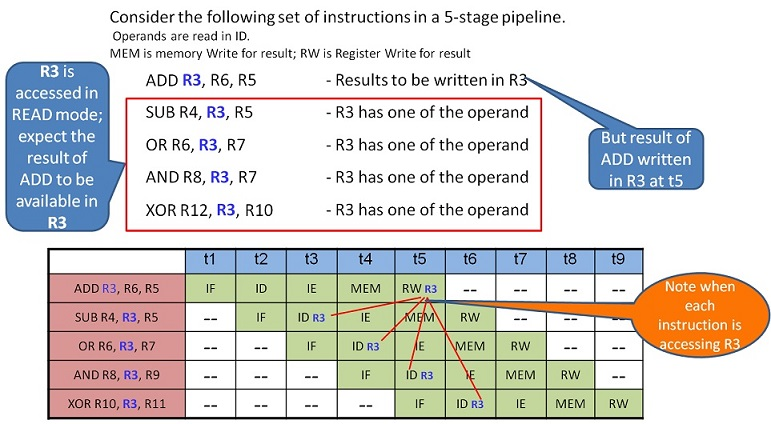

# Data Hazards

Data hazards occur when one instruction depends on the result of a previous instruction that has not yet completed its execution in the pipeline. This situation leads to potential conflicts when reading or writing registers, causing incorrect behavior unless handled properly.

---

## 1. Overview of Data Hazards

1. **Read After Write (RAW)**  
   - Also known as a **true data hazard**.  
   - Occurs when an instruction tries to read a register before a previous instruction has finished writing to it.  
   - Example: `ADD R3, R6, R5` followed by `SUB R4, R3, R5` — the SUB instruction needs the updated value of R3, which is not yet written back.

2. **Write After Read (WAR)**  
   - Arises when an instruction needs to write a register that a subsequent instruction has already read.  
   - In an in-order pipeline, this is generally not an issue, because reads happen early in the pipeline (ID stage) while writes happen later (WB stage). Thus, WAR hazards rarely occur in simple in-order designs.

3. **Write After Write (WAW)**  
   - Occurs when two instructions write to the same register in an overlapping time frame, causing the final value to be incorrect.  
   - Similar to WAR, this typically appears in out-of-order or superscalar pipelines but not in basic in-order pipelines.

In most simple 5-stage in-order RISC pipelines, the primary concern is the **RAW** hazard, which must be managed to maintain correctness.

---

## 2. Example of a RAW Hazard

Consider the following set of instructions in a 5-stage pipeline:

- **ADD R3, R6, R5** writes a new value to **R3**.
- The subsequent instructions (`SUB R4, R3, R5`, `OR R6, R3, R7`, `AND R8, R3, R7`, `XOR R12, R3, R10`) all read **R3** before the ADD instruction has written its result back to the register file.
- If not handled, the SUB, OR, AND, and XOR instructions will see the old value of R3, leading to incorrect results.

---

## 3. How Data Hazards Are Prevented

### 3.1 Forwarding (Bypassing)

- **Definition**: A hardware mechanism that routes the output of one pipeline stage directly to an earlier stage where it’s needed, bypassing the register file.
- **Usage**:  
  1. The EX stage of the next instruction can receive the ALU result from the EX/MEM or MEM/WB pipeline register of a previous instruction.  
  2. This technique covers the gap between the cycle in which the result is computed and the cycle in which it is normally written back to the register file.

**Example**:  
- The ADD instruction computes its result in the EX stage at cycle `t3`.  
- Without forwarding, the next instruction (SUB) would not see the updated R3 value until WB at `t5`.  
- With forwarding, the result is passed directly from EX to EX in the subsequent cycle, removing the need to wait until WB.

### 3.2 Stalling

- **Definition**: Temporarily pausing the pipeline for one or more cycles to allow an instruction to complete before a dependent instruction proceeds.
- **Usage**:  
  1. If the hazard detection unit detects that forwarding is insufficient (e.g., a load instruction’s data isn’t available until the MEM stage), it inserts “no-op” bubbles (stalls) in the pipeline.  
  2. The dependent instruction is delayed, ensuring it reads the correct data when it’s actually ready.

**Example**:  
- A load instruction that writes its result in the MEM stage might not have the data ready in time for a dependent instruction’s EX stage.  
- In that case, one or more stall cycles are introduced so that the load’s data is available before the dependent instruction executes.

### 3.3 Software Scheduling

- **Definition**: The compiler reorders instructions to avoid or reduce hazards.
- **Usage**:  
  1. Inserting independent instructions between a producing and consuming instruction.  
  2. Minimizing the need for stalls by rearranging code.

**Example**:  
- If the compiler detects a load followed immediately by a dependent instruction, it may insert an independent ALU instruction in between, giving the pipeline time to fetch the loaded data.

---

## 4. Summary

Data hazards are a natural consequence of overlapping instruction execution in a pipeline. **Read After Write (RAW)** hazards are the most common in simple in-order pipelines. Key hardware mechanisms—**forwarding** (bypassing) and **stalling**—are typically employed to mitigate these hazards. In more advanced designs, **out-of-order execution**, **compiler scheduling**, and **dynamic scheduling** further reduce the performance impact of data hazards.

By carefully designing both hardware and software to handle data hazards, modern processors maintain high instruction throughput without sacrificing correctness.
